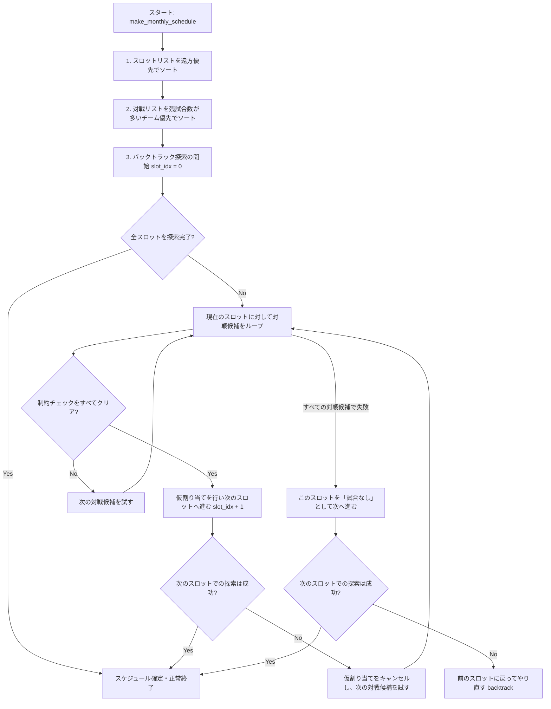

# ⚾ TRL 日程自動作成ロジック仕様書

TRL日程管理アプリにおける、日程（試合）自動作成ロジックの仕様についてまとめたドキュメントです。
本ロジックは、アプリ内の [app.py](file:///c:/Users/こつり/Desktop/GIT/TRL_app/app.py) の `make_monthly_schedule` 関数に実装されています。

---

## 1. ロジックの概要

提供された「対戦待ちプール (`match_pool`)」と「グラウンド空き枠 (`available_slots`)」から、各種制約条件を満たす月間スケジュールを自動生成します。
探索には**バックトラックアルゴリズム（深さ優先探索）**を採用しており、条件を満たす組み合わせを再帰的に探索し、すべてのスロットに対して最適な割り当てを行います。

---

## 2. 適用される4つの制約ルール（絶対条件）

スケジュールを作成する際、以下の4つの制約をすべて満たす必要があります。どれか1つでも満たさない場合、その組み合わせはスキップされます。

| 制約項目 | 内容 | 実装コード上のチェック方法 |
| :--- | :--- | :--- |
| **① 月間試合数の制限** | 各チーム、**月間最大 2 試合**までしか組めません。 | `team_monthly_counts[team] < 2` であること。 |
| **② 同日重複の禁止** | **同じ日に同じチームが2試合以上**行うことはできません（ダブルヘッダーの禁止）。 | `get_teams_playing_on(date)` で同日にすでに試合があるチームのリストを取得し、その中に含まれていないこと。 |
| **③ チームNG日の回避** | チームがあらかじめ登録した「NG日」には試合を組みません。 | `ng_days_dict` に登録されたNG日と、スロットの日付が一致しないこと。 |
| **④ 遠方グラウンド制限** | 遠方フラグがあるグラウンドには、**遠方移動が許可されているチーム同士**の対戦しか組めません。 | `is_far_ground` が `True` の場合、対戦する両チームの `allow_far` が `True` であること。 |

---

## 3. 優先順位ルール（優先して組む条件）

探索の効率化および偏りの防止のため、スロットの探索順と対戦カードの選定順に以下の優先順位（ソート）を適用しています。

### 優先①：遠方グラウンドの優先割り当て
* **仕様**: 確保しているグラウンド枠の中に遠方グラウンドがある場合、**通常のグラウンドを処理する前に遠方グラウンドの割り当てを優先**します。
* **背景**: 遠方グラウンドは「両チームが遠方OKであること」という厳しい制約があるため、通常グラウンドを先に埋めてしまうと、遠方OKチームの対戦が消費されてしまい、遠方グラウンドに試合が組めなくなる（空きになってしまう）ためです。

### 優先②：残り試合数の多いチームの優先割り当て
* **仕様**: 未決定の対戦プール (`match_pool`) の中で、**残り試合数（ホームアウェイ合計）が多いチームの対戦を優先的**に候補として処理します。
* **ソート順の基準**:
  1. 第一優先：対戦ペアのいずれかのチームの「最大残り試合数」の降順
  2. 第二優先：対戦ペア両者の「残り試合数の合計」の降順
* **背景**: 残り試合数が多く残っているチームの試合を後回しにせず積極的に消化させることで、リーグ終盤に特定のチームだけ試合が詰まってしまう現象を防ぎます。

---

## 4. アルゴリズムの動作フロー

